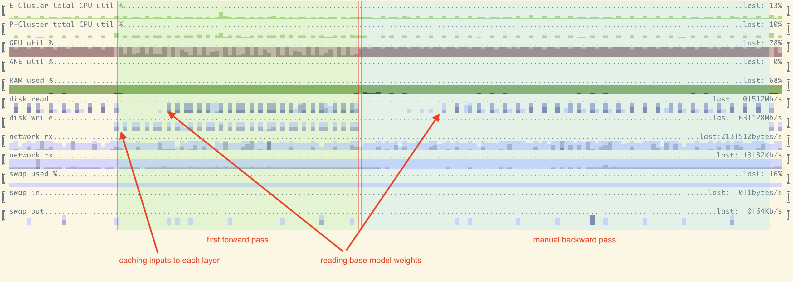
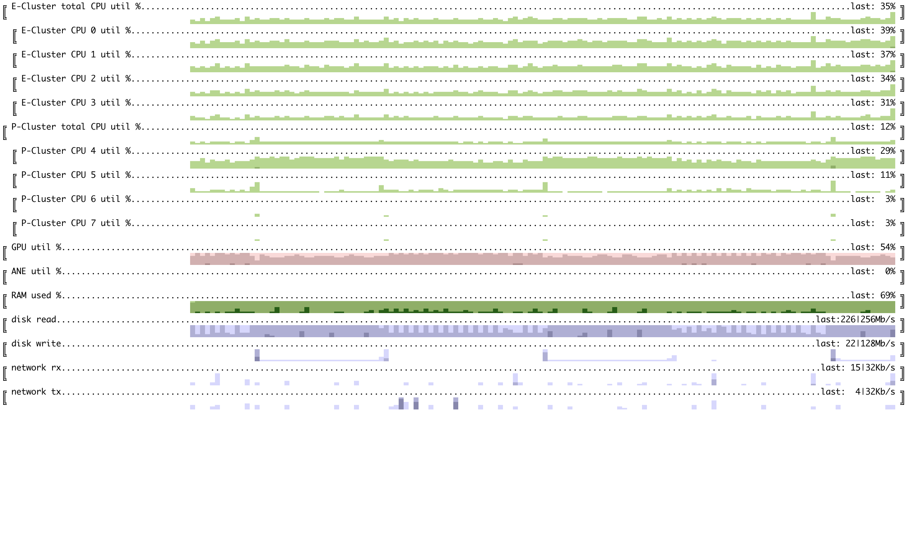
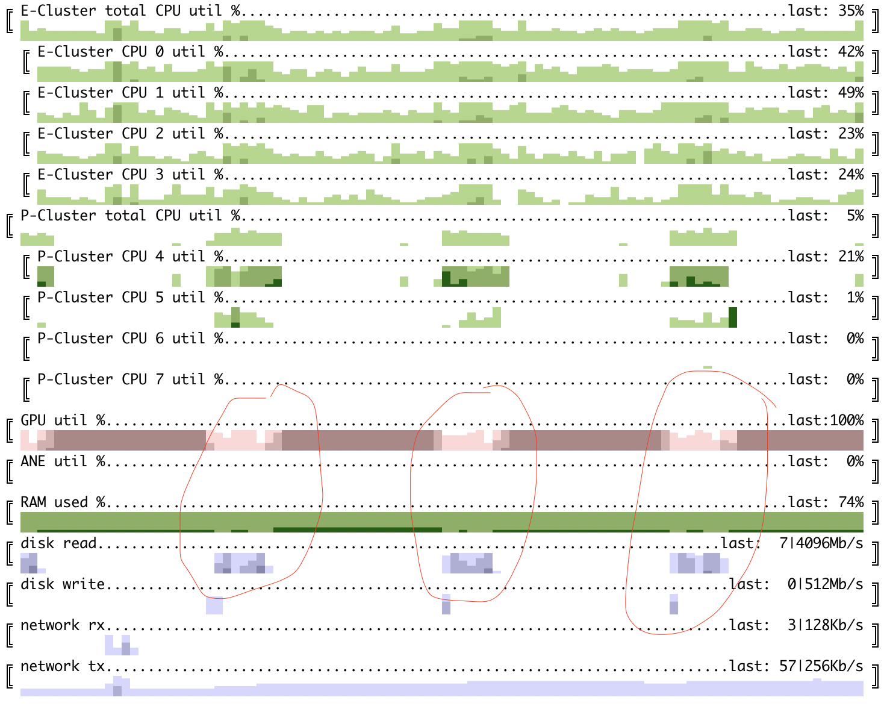
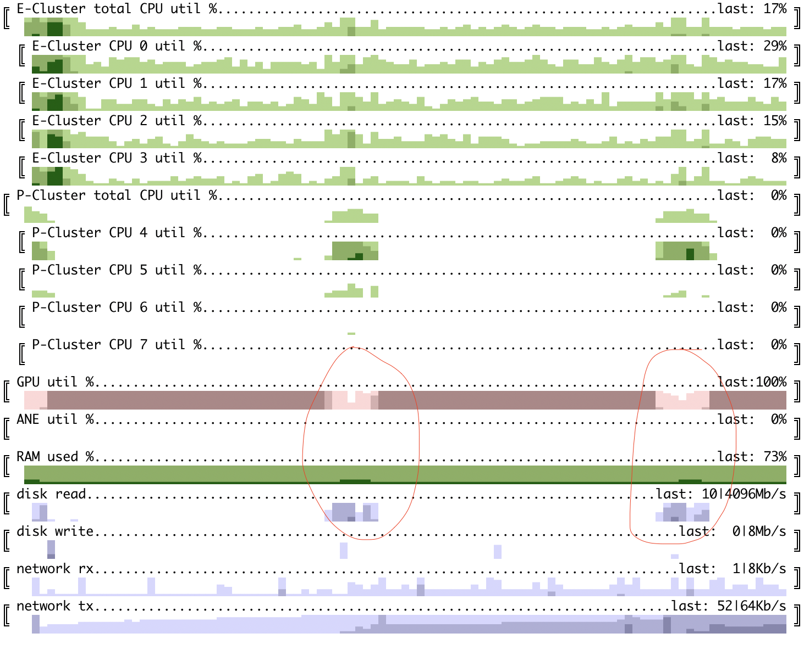

## slowllama

Fine-tune Llama2 and CodeLLama models, including 70B/35B on Apple M1/M2 devices (for example, Macbook Air or Mac Mini) or consumer nVidia GPUs.

slowllama is not using any quantization. Instead, it offloads parts of model to SSD or main memory on both forward/backward passes. In contrast with training large models from scratch (unattainable) or inference, where we are likely to care about interactivity, we can still get something finetuned if you let it run for a while.

Current version is using LoRA to limit the updates to a smaller set of parameters. First version supported full finetuning as well, but I decided to remove it for now, more on that below. 

Finetuning is the only focus, there's nothing special done for inference, consider [llama.cpp](https://github.com/ggerganov/llama.cpp).

For CUDA-specific experiments, see [report on a10](docs/a10.md).

It is all very experimental, but even more so for CUDA.

### Example

Tests were done on Apple M1 with 16Gb memory and Apple M2 with 24Gb memory. 

In order to fine-tune llama2 model we need to:
1. Install dependencies: ```pip install torch sentencepiece numpy```. Optional: install ```pip install fewlines``` for [weight/gradient distribution logging](docs/lora_weights.md).
2. Clone [llama2](https://github.com/facebookresearch/llama) and follow instructions to download the models. The script will download tokenizer as well. ```tokenizer.model``` should be put into the same directory as llama model itself. Use [codellama](https://github.com/facebookresearch/codellama) for CodeLLama models. Example folder structure could look like:
```
/parent/
    /slowllama/...   # <- this repo
    /llama-2-7b/...  # <- put tokenizer.model here
    /llama-2-13b/... # <- and here
    /llama-2-70b/... # <- and here as well
    /CodeLlama-34b-Python/... # and here
```

Let's start with a [tiny example](test_data/cubestat.txt). It is an intro to the description of another open-source project - [cubestat](https://github.com/okuvshynov/cubestat). Text is short enough to just be included as part of the prompt, but it's ok as an illustration and you can read it in seconds youself. As I just published that project recently, there's no way original llama would know anything about it. 

Asking base llama2-7b to complete the prompt _"Cubestat reports the following metrics: "_ results in _"1) the number of cubes in the system, 2) the number of cubes that are in the process of being created"_. 

First step is to transform the model to the sequential format more suitable for loading to/from storage block-by-block. 

```
python prepare_model.py
```

The paths to the input and output models are configured in the conf files. There's a base file [conf.py](conf.py) and two files with some overrides [conf_fp16.py](conf_fp16.py) and [conf_fp32.py](conf_fp32.py). By default [prepare_model.py](prepare_model.py) uses fp16 config. Modify these files with the paths you have your models in.
The scripts below use the same configuration files as well.

Now we can try not-finetuned llama2:
```
python test_gen.py
```

Now let's finetune the 7b model. [finetune.py](finetune.py) is a very simple script which trains LoRA weights based on the plaintext data. There are some settings you could change here, like sequence length, batch size, learning rate, dropout rate, number of iterations. Current settings are pretty much a guess, change this if desired. Currently it uses AdamW optimizer.

```
python finetune.py
```

Here's train dataset loss:
```
2023-09-10 22:05:35,569 backprop done, loss after forward pass = 2.9539270401000977
2023-09-10 22:06:08,022 backprop done, loss after forward pass = 2.9073102474212646
2023-09-10 22:06:40,223 backprop done, loss after forward pass = 2.7192320823669434
2023-09-10 22:07:12,468 backprop done, loss after forward pass = 2.7223477363586426
2023-09-10 22:07:44,626 backprop done, loss after forward pass = 2.5889995098114014
2023-09-10 22:08:16,899 backprop done, loss after forward pass = 2.4459967613220215
2023-09-10 22:08:49,072 backprop done, loss after forward pass = 2.3632657527923584
2023-09-10 22:09:21,335 backprop done, loss after forward pass = 2.250361442565918
2023-09-10 22:09:53,511 backprop done, loss after forward pass = 2.165428638458252
2023-09-10 22:10:25,738 backprop done, loss after forward pass = 2.031874656677246
2023-09-10 22:13:45,794 backprop done, loss after forward pass = 1.8926434516906738
2023-09-10 22:14:18,049 backprop done, loss after forward pass = 1.7222942113876343
2023-09-10 22:14:50,243 backprop done, loss after forward pass = 1.58726966381073
2023-09-10 22:15:22,405 backprop done, loss after forward pass = 1.4983913898468018
2023-09-10 22:15:54,598 backprop done, loss after forward pass = 1.296463131904602
2023-09-10 22:16:26,909 backprop done, loss after forward pass = 1.3328818082809448
2023-09-10 22:16:59,031 backprop done, loss after forward pass = 1.0978631973266602
2023-09-10 22:17:31,200 backprop done, loss after forward pass = 1.018444538116455
2023-09-10 22:18:03,406 backprop done, loss after forward pass = 0.8421685099601746
2023-09-10 22:18:35,673 backprop done, loss after forward pass = 0.7168515920639038
2023-09-10 22:21:55,482 backprop done, loss after forward pass = 0.7870235443115234
```

I didn't add a validation set for this data, instead I just checked what would the fine-tuned model produce for the same prompt.

At ~10 iteration we get the following reasonable output:  _Cubestat reports the following metrics: 1. CPU usage, 2. Memory usage, 3. Disk usage_

At ~20 iteration another output is produced:

_0 - Cubestat reports the following metrics: CPU utilization: Efficiency and Performance cores. Shows as percentage._

Maybe we were overfitting already at this point.

Running completion with newly produced lora checkpoint can be done like this:

```
python test_gen.py ./out/state_dict_19.pth
```

### How does it work?
For all versions the process is roughly the same.

First, we need to be able to load a model which requires more RAM than we have and save it back in sequential format. We create model instance with all large modules' weights offloaded to SSD - all of the transformer blocks, token embeddings and output linear layer. After that we [load model shards one by one](https://github.com/okuvshynov/slowllama/blob/main/llama2_loader.py#L69), for each shard iterate over all modules, update corresponding subset of its weights and save it back. 

Doing forward path is easy - we just load modules when we need and pass the output forward. 

Backward pass is a little more tricky, in a way we have to run forward pass twice. The way it's [currently implemented](https://github.com/okuvshynov/slowllama/blob/main/llama2.py#L307) is:
1. Do a forward pass while also saving inputs to each offloaded block to the SSD. The goal of the first forward pass is to compute the final loss and cache inputs to each offloaded block. 
2. Then, do a manual backward gradient propagation. We start from the last block, re-run each block once again (forward, to build autograd graph) with the same input we cached on step (1). After that we run backward pass within that block only, and pass the gradient for the input to the next (previous?) block. As we use LoRA, only LoRA gradients are being saved. LoRA weights are not offloaded to disk, always staying on RAM/GPU. Important: we also need to save and restore random number generation state before evaluating each offloaded module. During training we use dropout, and randomly switched off neurons should be the same on both forward passes.
3. After that we run optimizer step on LoRA weights and save them separately if needed.

Original llama2 weights are in bfloat16, but mps backend doesn't support that type natively, so we do computation in float32 instead.

Experimental version of slowllama which can be still found [here](https://github.com/okuvshynov/experiments/tree/5cf944cb1274e577d1e755e6ad1957190d286d9d/split_model) was capable of doing full finetuning and update all weights pretty much the same way. I've temporarily removed that feature to preserve the lifespan of SSDs, as frequent write operations can degrade performance over time. Reading from SSDs isn't an issue, but they do have a write limit. Limit is typically high enough for normal usage, but in the case of full finetunining we'll have to write ~150Gb per one iteration/weight update of 70B variant, assuming stateless optimizer and no gradient accumulation. With AdamW we'll have to save/update another 150Gb more of optimizer state per iteration. If, for example, we assume 1Pb of writes before SSD will start having issues, even 100 iterations of finetuning would incur significant cost/risk.

### Experiments 

#### Llama2 7B finetune on M1 Mini (16Gb memory):



Here we can see resource utilization for 1 full iteration on 7B model - forward and manual backward passes. Each column == 1 second. A few notes:
1. GPU is reasonably well utilized;
2. First forward pass has lower GPU utilization and spends more time on IO as we need to both read weights and write cached inputs/outputs
3. Backward (combined?) pass achieves very high GPU utilization, close to 100%
4. As we move along layers back and forth, right after each 'direction switch' we process layers in LIFO order. Thus in the beginning of both forward and backward pass we don't have to access disk, weights are being cached and we don't see disk reads.

batch_size/seq_len - works ok with, say, 2048 seq_len and batch_size = 2. 

#### Llama2 70B finetune on M1 Mini (16Gb memory)


The chart here has different granularity - each column is 30 seconds. Input data was also different - it is the readme file you are reading now.
I didn't have enough free space on disk to store both original weights (140Gb) + weights in sequential format we use (another 140Gb). In order to still be able to finetune this model, I stored original weights on much slower external SD card, as we need to read them only once. Weights in sequential format on fast internal SSD. 
With batch size = 16 and sequence length = 128 it was taking ~25-30 min per iteration.

As we can see, GPU utilization doesn't look that great - we might be able to benefit from prefetching next transformer block, assuming we have enough memory for storing 2 layers. Memory utilization peaked at around 80% of 16Gb. 

Loss over time:

```
2023-09-13 17:30:28,731 backprop done, loss after forward pass = 2.431253433227539
2023-09-13 18:00:00,133 backprop done, loss after forward pass = 2.604712963104248
2023-09-13 18:29:36,473 backprop done, loss after forward pass = 2.6277880668640137
2023-09-13 19:00:40,463 backprop done, loss after forward pass = 2.408756971359253
2023-09-13 19:29:55,974 backprop done, loss after forward pass = 2.6121537685394287
2023-09-13 19:59:04,849 backprop done, loss after forward pass = 2.428431987762451
2023-09-13 20:27:03,760 backprop done, loss after forward pass = 2.4040215015411377
2023-09-13 20:55:56,969 backprop done, loss after forward pass = 2.158071279525757
2023-09-13 21:25:04,615 backprop done, loss after forward pass = 2.3459620475769043
2023-09-13 21:54:07,128 backprop done, loss after forward pass = 2.2933709621429443
2023-09-13 23:18:57,588 backprop done, loss after forward pass = 2.273494243621826
2023-09-13 23:48:05,310 backprop done, loss after forward pass = 2.4055371284484863
2023-09-14 00:17:19,113 backprop done, loss after forward pass = 2.2604546546936035
2023-09-14 00:46:31,872 backprop done, loss after forward pass = 2.552386522293091
2023-09-14 01:15:45,731 backprop done, loss after forward pass = 2.297588586807251
2023-09-14 01:44:51,640 backprop done, loss after forward pass = 2.1217401027679443
2023-09-14 02:14:09,033 backprop done, loss after forward pass = 1.9815442562103271
2023-09-14 02:43:09,114 backprop done, loss after forward pass = 2.020181179046631
2023-09-14 03:12:17,966 backprop done, loss after forward pass = 2.0041542053222656
2023-09-14 03:41:20,649 backprop done, loss after forward pass = 1.9396495819091797
2023-09-14 05:06:31,414 backprop done, loss after forward pass = 2.1592249870300293
2023-09-14 05:35:39,080 backprop done, loss after forward pass = 1.976989984512329
2023-09-14 06:04:57,859 backprop done, loss after forward pass = 1.7638890743255615
2023-09-14 06:34:06,953 backprop done, loss after forward pass = 1.9829202890396118
2023-09-14 07:03:18,661 backprop done, loss after forward pass = 1.754631519317627
2023-09-14 07:32:26,179 backprop done, loss after forward pass = 2.027863025665283
2023-09-14 08:01:37,546 backprop done, loss after forward pass = 1.8579339981079102
2023-09-14 08:30:41,689 backprop done, loss after forward pass = 1.7934837341308594
2023-09-14 08:59:55,921 backprop done, loss after forward pass = 1.794022798538208
2023-09-14 09:28:59,690 backprop done, loss after forward pass = 1.750269889831543
2023-09-14 10:56:19,282 backprop done, loss after forward pass = 1.4310824871063232
2023-09-14 11:25:28,462 backprop done, loss after forward pass = 1.6895856857299805
2023-09-14 11:54:39,973 backprop done, loss after forward pass = 1.5074403285980225
2023-09-14 12:23:42,604 backprop done, loss after forward pass = 1.6695624589920044
2023-09-14 12:53:00,535 backprop done, loss after forward pass = 1.4220315217971802
2023-09-14 13:22:15,685 backprop done, loss after forward pass = 1.5720497369766235
2023-09-14 13:51:30,744 backprop done, loss after forward pass = 1.544579267501831
2023-09-14 14:20:44,482 backprop done, loss after forward pass = 1.2813694477081299
2023-09-14 14:50:03,384 backprop done, loss after forward pass = 1.2990479469299316
2023-09-14 15:19:09,620 backprop done, loss after forward pass = 1.0500637292861938
```

We used prompt 'slowllama is a ', and here you can see the completions:
* before any weight update: _slowllama is a 24 year old (DOB: December 25, 1994) pure-blood witch_
* after 10 iterations: _slowllama is a 24 year old (DOB: December 25, 1994) pure-blood witch_
* after 20 iterations: _slowllama is a 70B model trained on the same data as llama.70b, but with a different training setup._
* after 30 iterations: _slowllama is a 2022 fork of llama2, which is a 2021 fork of llama, which is a 2020 fork_
* after 40 iterations: _slowllama is a 2-stage finetuning implementation for llama2._

Current setup is probably too slow for 70B model finetuning on old mac mini M1. It would be interesting to try it on more recent hardware (say, M2 Max / M2 Pro), implement prefetch/async save and see how it's going to work.

**Float16 update:**

Using Fp16 both for storing frozen weights and compute on MPS devices considerably improves memory requirements and time for iteration. A few notes: 
* update torch to 2.1.0, otherwise mps might try to use apple neural engine for fp16 compute and it's not working quite well yet (see https://github.com/pytorch/pytorch/issues/110975) 
* time win comes from the fact that we don't have to transform each block from bf16 to fp32.

Here you can see finetune 70B model with M1 mac mini where weights are stored in fp16 and compute is done in fp16 as well. Input size is fairly small - batch size = 16 and seq_len = 128.

Forward pass with 100ms granularity


Combined pass with 100ms granularity


GPU utilization is at ~89% for combined pass and ~78% for forward. Now prefetch and saving in different format might make a difference.

### merging LoRA weights back

In order to merge LoRA checkpoint back to the model in original format, we can do the following:

```
# confirm that old model is producing wrong output
python test_gen.py

...
0 - Cubestat reports the following metrics: 1) the number of cubes in the system, 2) the number of cubes that are currently running, 3) the number of cubes that are currently stopped, 4) the number of cubes that are currently in the process of starting,

# check what would be the output for finetuned model by passing path to checkpoint
python test_gen.py ./out/state_dict_18.pth

...
0 - Cubestat reports the following metrics:

CPU utilization - configurable per core ('expanded'), cluster of cores: Efficiency/Performance ('cluster') or both. Is shown as percentage.
GPU utilization per card/chip. Is shown in percentage. Works for Apple's M1/M2 SoC and nVidia GPUs. For nVidia GPU shows memory usage as well.
ANE (Apple's Neural Engine) power consumption.....

# now run merge. we need to pass: 
#   - original model path
#   - new path for new model
#   - lora checkpoint path
# note that merge would first delete the output directory if it exists and copy over original weights there. 
python merge_lora.py ../llama-2-13b ./out/state_dict_18.pth ../llama-2-13b-out

# at this point ../llama-2-13b-out is merged can be used in exactly same way as original llama2 for further quantization, inference, etc.


# If we want to run inference within slowllama for testing, we need to run prepare_model.py again.
# update the llama2_model_path in conf.py to be  ../llama-2-13b-out/ and in conf_16.py frozen_model_path = '../llama13b_f16-out'

python prepare_model.py

# now run new model with no extra checkpoint, observe new output, same as in runtime-combined model: 
python test_gen.py 

...
0 - Cubestat reports the following metrics:

CPU utilization - configurable per core ('expanded'), cluster of cores: Efficiency/Performance ('cluster') or both. Is shown as percentage.
GPU utilization per card. Is shown in percentage. Works for Apple's M1/M2 SoC and nVidia GPUs. For nVidia GPU shows memory usage as well.
ANE (Apple's Neural Engine) power consumption.....

```

### Project structure

Just a few files with no dependencies other than torch, numpy and sentencepiece for tokenizer.

1. [llama2.py](llama2.py) -- model definition and manual backprop implementation. It's based on model.py from [llama2.c](https://github.com/karpathy/llama2.c), also MIT licenced.
2. [finetune.py](finetune.py) - script which does the training
3. [llama2_loader.py](llama2_loader.py) - manual loading/saving of large llama2 models
4. [utils.py](utils.py) - small utility functions, including saving/loading random generator state for different devices.
5. [test_gen.py](test_gen.py) - greedily complete the prompt. Takes base weights + trained LoRA weights as input. Useful for sanity checks.
6. [blackbox.py](blackbox.py) - module wrapper which offloads the module to disk or main memory.
7. [plot_lora.py](plot_lora.py) - logging utility, writes LoRA weights and gradient distribution to [logfile](docs/lora_weights.md). Requires [fewlines](https://github.com/okuvshynov/fewlines). If fewlines is not installed, does nothing.
8. [merge_lora.py](merge_lora.py) - merge original weights + lora weights in the original format which can then be used directly.
9. [prepare_model.py](prepare_model.py) - script to transform sharded model to sequentially split model.

### TODO:

```
[ ] masking
[ ] optimizations -- focus on memory usage
    [ ] consider splitting transformer block into attention/ff
    [ ] check if loading state dict to the same block instance would avoid the reallocation
    [ ] microopt - no need to compute gradient for some of the leaf parts
[ ] more generic train routine
    [ ] pause/resume from LoRA snapshot
    [ ] do not create LoRA layers on prepare, only on finetune?
[ ] optimizations - prefetch the next layer/input, save asyncronously, etc;
[ ] gradient accumulation
[ ] plot something like memory requirement for (batch_size , seq_len)
[ ] combined RAM/disk offload - 200Gb RAM is rarity.
[ ] tests, cleanup and comments;
[ ] progress tracking for everything;
[ ] quantization beyond 16 bit?
[ ] configurable weight tying;
[ ] double check RNG state correctness.
```

### References
* [llama2](https://github.com/facebookresearch/llama)
* [llama.cpp](https://github.com/ggerganov/llama.cpp)
* [llama2.c](https://github.com/karpathy/llama2.c)
* [cubestat](https://github.com/okuvshynov/cubestat)
* [LoRA](https://arxiv.org/abs/2106.09685)

### Contact

{github handle} @ gmail.com
